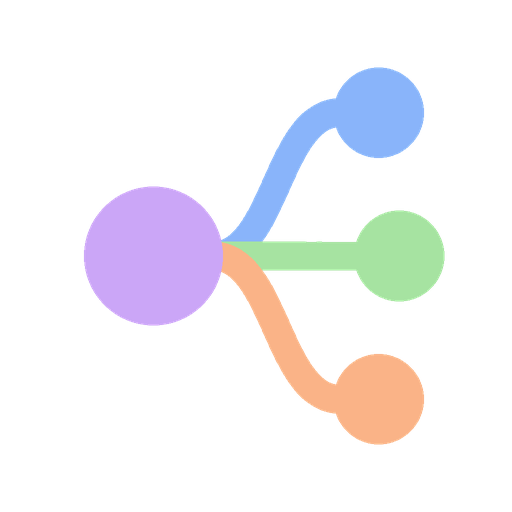
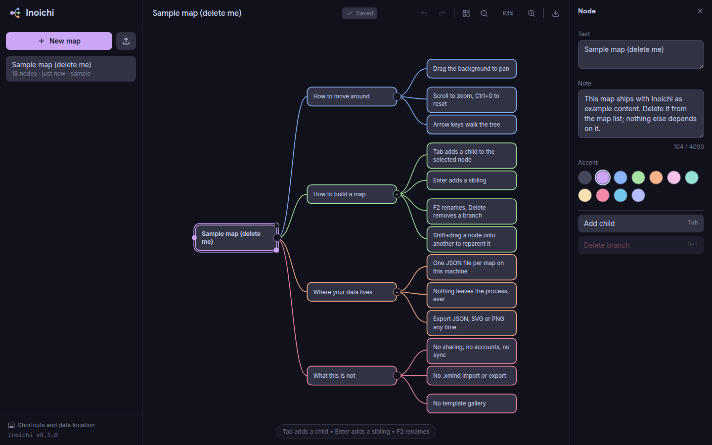

<div align="center">
  
  <h1>Inoichi</h1>

  <a href="https://github.com/tanq16/inoichi/actions/workflows/release.yaml"></a>&nbsp;<a href="https://github.com/tanq16/inoichi/releases"></a><br><br>
  <a href="#features">Features</a> &bull; <a href="#install">Install</a> &bull; <a href="#usage">Usage</a> &bull; <a href="#security">Security</a> &bull; <a href="#notes">Notes</a>
</div>

---

Inoichi is a local-first mind mapping editor. One Go binary serves the whole app, and every map is a JSON file in a directory you choose.

It covers the part of a mind mapping tool most people use: draw a tree, move it around, attach longer notes, get it out again. It is not a collaboration tool, a template gallery, or an Xmind file reader.

## Features

| Area | What you get |
|---|---|
| Editing | Drag, resize, reparent, cross-link, collapse, accent colours |
| Markdown | Any node carries a Markdown document, edited in the node panel and opened rendered in a modal with highlighted code, callouts and copy buttons |
| Keyboard | Tab, Enter, Space, Delete, arrow-key navigation, undo and redo, zoom, tidy layout |
| Persistence | Maps live in memory on the server and reach disk a couple of seconds after the last change |
| Getting out | Export JSON, SVG or PNG, and import any JSON this app exported |
| Deployment | One static binary with the frontend embedded, installable as a desktop web app |

Everything is single-user by design. There are no accounts, no sharing, no telemetry, and no outbound network requests at run time. The editor is built for a desktop window and refuses portrait or phone-sized screens.

## Screenshot

<details>
<summary>Click to expand</summary>



</details>

## Install

### Release binary

Every release on the [releases page](https://github.com/tanq16/inoichi/releases) carries a static binary for `linux/amd64`, `linux/arm64`, `darwin/amd64` and `darwin/arm64`. Download the one for your platform, mark it executable, and run `inoichi`. The editor is then at `http://localhost:8080`.

### From source

Needs Go 1.27 and `curl`. `make build` downloads the pinned frontend assets, which are never committed, then compiles them into the binary.

```bash
git clone https://github.com/tanq16/inoichi.git
cd inoichi
make build
./inoichi
```

## Usage

The binary takes no subcommands: running it serves the editor. Every flag reads an environment variable of the same name as its default, so `.env.example` and the flags describe one set of settings rather than two.

```bash
inoichi --host 127.0.0.1 -p 8080 -d ./data
```

| Flag | Environment | Default | Description |
|------|-------------|---------|-------------|
| `--host` | `INOICHI_HOST` | `127.0.0.1` | Address to bind |
| `--port`, `-p` | `INOICHI_PORT` | `8080` | Port to listen on |
| `--data-dir`, `-d` | `INOICHI_DATA_DIR` | `./data` | Directory holding the map files |
| `--no-sample` | | off | Skip writing the sample map into an empty data directory |
| `--debug` | | off | Log at debug level |

Inoichi holds no secrets and needs no credentials, so `.env.example` carries only those three settings. Copy it to `.env` if you prefer environment variables to flags; `.env` itself is gitignored.

### Where your data lives

One JSON file per map at `<data-dir>/maps/<id>.json`, written at mode `0600` inside a directory at `0700`. The data directory defaults to `data` inside the directory you start the binary from, so a plain `inoichi` keeps its maps next to it.

The server keeps every map in memory and writes a changed map to disk two seconds after its last save, so a burst of edits costs one write. Stopping the server with Ctrl-C or SIGTERM writes everything that is still pending before it exits.

Back it up by copying that directory. Restore it by copying it back. A single map moves between machines through the JSON export and import buttons, which produce and accept the same format the files hold.

The first run on an empty data directory writes one sample map titled `Sample map (delete me)`. Delete it from the map list when you are done reading it; nothing else depends on it, and `--no-sample` skips it entirely.

### Editing

| Keys | Action |
|---|---|
| `Tab` | Add a child to the selected node |
| `Enter` | Add a sibling |
| `Space` or double click | Rename a node |
| `Delete` | Delete the node and its branch |
| Arrow keys | Walk parent, child and siblings |
| `/` | Collapse or expand a branch |
| `Ctrl/Cmd` + `Enter` | Open the selected node's Markdown rendered |
| `Esc` | Deselect |
| `Shift` + drag | Drop a node on another to reparent it |
| `Ctrl/Cmd` + `Z` / `Shift+Z` | Undo and redo |
| `Ctrl/Cmd` + `S` | Save now instead of waiting for autosave |
| `Ctrl/Cmd` + scroll | Zoom at the pointer |
| `Ctrl/Cmd` + `0` | Fit the map to the screen |
| `Ctrl/Cmd` + `Shift` + `L` | Tidy the layout |
| `[` and `]` | Show or hide the map list and the node panel |
| `?` | Open the shortcuts panel |

Selecting a node opens the node panel on the right, with its text, accent and Markdown. Clicking empty canvas deselects and closes it again. Both side panels hide with a click on their icon and resize by dragging their inner edge.

A node with Markdown shows a small page icon. Clicking it, or pressing `Ctrl/Cmd` + `Enter`, opens the rendered document in a modal. The raw Markdown stays in the node panel, where it is edited.

Dragging the dot on a selected node's left edge onto another node draws a cross link, which is the one relationship that does not follow the tree.

Edits save about a second after you stop, and never later than five seconds into a run of continuous typing. A small check mark blips in the header when a save lands. A failed save turns that mark red and clicking it retries; the map stays on screen either way.

Dragging the resize handle and drawing a cross link are pointer gestures with no keyboard equivalent. Everything the core loop needs (adding, renaming, navigating, collapsing, deleting, undo, zoom, tidy and export) is on the keyboard.

### Scripts

| Command | Does |
|---|---|
| `make install` | Resolve Go modules and download the pinned frontend assets |
| `make dev` | Run from source with debug logging against `./.devdata` |
| `make test` | Run the unit tests |
| `make smoke` | Build, then drive the real UI in a headless browser end to end |
| `make build` | Build the binary for this platform |
| `make run` | Build and serve exactly as a release would |

`make smoke` needs Chrome or Chromium. It finds the common install paths on its own, and `INOICHI_CHROME` points it somewhere else.

## Security

Inoichi has no login, because it is built for one person on one machine. Anything that can reach the port can read and edit every map, so the default bind is `127.0.0.1` and moving it to `0.0.0.0` puts your maps on your network with no authentication in front of them.

Put a reverse proxy with real authentication in front of it before exposing it anywhere. The server writes no map content to its logs, and it makes no outbound requests, so nothing about your maps leaves the process.

Open one map in one tab. The server rejects a save whose base version has moved on, so a second tab holding stale state gets an error rather than silently overwriting the first, but it will not merge the two.

Imported JSON is validated before it is stored: ids are checked against a strict format that cannot escape the data directory, parent references must exist, cycles are rejected, and text, node counts and coordinates are clamped to their limits. Markdown is rendered through DOMPurify, so a note in an imported file cannot run script in your browser.

## Notes

- **No Xmind interoperability.** Inoichi does not read or write `.xmind`, `.mm`, or OPML. Its JSON is the only format that round-trips.
- **Desktop only.** A portrait or phone-sized window gets a notice instead of the editor. The app still installs as a progressive web app on a desktop browser, and its service worker caches nothing, so a refresh always shows the running binary's version.
- **Exported SVG and PNG use the reader's fonts.** No font is embedded, so an exported file falls back to the viewer's sans-serif if Inter is not installed. Markdown is not part of the image exports; a node with Markdown carries a page icon in them.
- **One tree per map.** A node has exactly one parent, and cross links are decoration rather than a second hierarchy.
- **One tab at a time.** There is no merge. A save from a tab whose copy has fallen behind is refused with a conflict rather than applied.
- **Tailwind compiles in the browser.** That is the documented development mode rather than a build step, which is fine for a personal tool and means the first paint does a little work.
- **Layout runs on the server.** Tidying a map posts it to `/api/layout`, so there is one layout implementation rather than one per surface.
- **Architecture** is written up in [docs/architecture.md](docs/architecture.md) for anyone changing the code.
